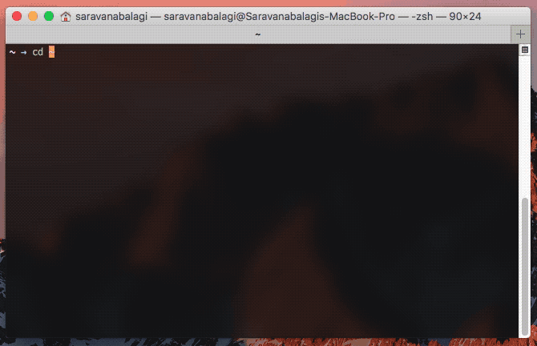
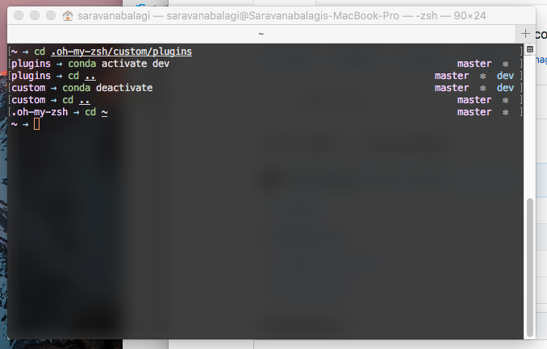

# Modesty
A clean and modest zsh theme with support for condaenv, virtualenv and git neatly right aligned while the folder you are in is displayed 



## Installation

You can download [modesty.zsh-theme](https://github.com/saravanabalagi/zsh-theme-modesty/raw/master/modesty.zsh-theme) and place it in `$ZSH_CUSTOM/themes` (usually at `~/.oh-my-zsh/custom/themes`)

or use the following script to do the same

```
mkdir temp
git clone https://github.com/saravanabalagi/zsh-theme-modesty temp
mv temp/modesty.zsh-theme $ZSH_CUSTOM/themes
rm -rf temp
```

Then edit your `~/.zshrc` file to include the following, replace `ZSH_THEME` value if already exists:

```
ZSH_THEME="modesty"
```

Enjoy Modesty



## Licence

Please refer to the [License](LICENSE) file.
